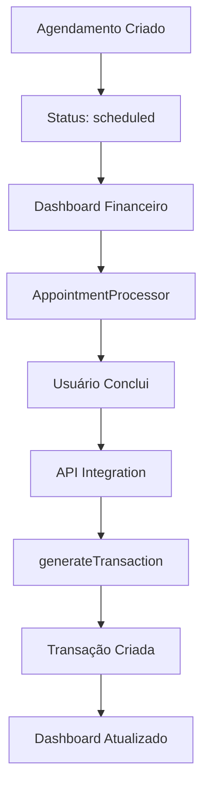

# Integração Financeira com Agendamentos - Pet Connect

## 📋 Visão Geral

Este documento detalha a implementação da integração entre o sistema de agendamentos e o módulo financeiro do Pet Connect, permitindo a geração automática de transações financeiras a partir de agendamentos concluídos.

## 🎯 Funcionalidades Implementadas

### 1. Geração Automática de Transações
- Criação automática de transações quando agendamentos são concluídos
- Busca ou criação de conta padrão para receitas
- Busca ou criação de categoria "Serviços" para classificação
- Validação de dados e tratamento de erros

### 2. Dashboard de Métricas
- Exibição de receita total dos agendamentos
- Receita pendente (agendamentos não concluídos)
- Número de agendamentos concluídos e pendentes
- Cálculo do ticket médio
- Atualização em tempo real

### 3. Processamento de Agendamentos
- Interface para concluir ou cancelar agendamentos
- Lista de agendamentos com status "scheduled"
- Atualização automática após processamento
- Feedback visual para o usuário

## 🏗️ Arquitetura Técnica

### Componentes Principais

#### 1. Lógica de Negócio
**Arquivo:** `src/lib/appointment-financial-integration.ts`

```typescript
// Funções principais
export async function generateTransactionFromAppointment(appointmentId: string)
export async function onAppointmentCompleted(appointmentId: string)
export async function getAppointmentFinancialStats()
export async function processAppointment(appointmentId: string, action: 'complete' | 'cancel')
```

#### 2. Componentes de Interface

**AppointmentIntegration** (`src/components/financial/appointment-integration.tsx`)
- Exibe métricas de integração
- Cards com receita total, pendente, agendamentos e ticket médio
- Estados de carregamento e erro

**AppointmentProcessor** (`src/components/financial/appointment-processor.tsx`)
- Lista agendamentos pendentes
- Botões para concluir/cancelar
- Atualização em tempo real

#### 3. API de Integração
**Arquivo:** `src/app/api/financial/appointment-integration/route.ts`

**Endpoints:**
- `GET /api/financial/appointment-integration` - Busca estatísticas
- `POST /api/financial/appointment-integration` - Processa agendamentos

### Fluxo de Dados



## 🔧 Implementação Detalhada

### 1. Geração de Transações

```typescript
export async function generateTransactionFromAppointment(appointmentId: string) {
  // 1. Busca dados do agendamento
  const appointment = await getAppointmentData(appointmentId)
  
  // 2. Valida se tem valor
  if (!appointment.total_amount || appointment.total_amount <= 0) {
    throw new Error('Agendamento sem valor válido')
  }
  
  // 3. Busca/cria conta padrão
  const account = await getOrCreateDefaultAccount()
  
  // 4. Busca/cria categoria de serviços
  const category = await getOrCreateServiceCategory()
  
  // 5. Cria transação
  const transaction = await createTransaction({
    account_id: account.id,
    category_id: category.id,
    amount: appointment.total_amount,
    type: 'income',
    description: `Serviço: ${appointment.service?.name} - ${appointment.client?.name}`,
    date: new Date().toISOString(),
    appointment_id: appointmentId
  })
  
  return transaction
}
```

### 2. Processamento de Agendamentos

```typescript
export async function processAppointment(appointmentId: string, action: 'complete' | 'cancel') {
  const response = await fetch('/api/financial/appointment-integration', {
    method: 'POST',
    headers: { 'Content-Type': 'application/json' },
    body: JSON.stringify({ appointmentId, action })
  })
  
  if (!response.ok) {
    throw new Error('Erro ao processar agendamento')
  }
  
  return response.json()
}
```

### 3. Estatísticas Financeiras

```typescript
export async function getAppointmentFinancialStats() {
  const response = await fetch('/api/financial/appointment-integration')
  
  if (!response.ok) {
    throw new Error('Erro ao buscar estatísticas')
  }
  
  return response.json()
}
```

## 🔒 Segurança

### Row Level Security (RLS)
- Todas as queries respeitam o `company_id` do usuário
- Isolamento completo entre pet shops
- Validação de permissões em todas as operações

### Validação de Dados
- Validação de entrada em todas as APIs
- Sanitização de dados do usuário
- Tratamento de erros com mensagens apropriadas

### Autenticação
- Verificação de usuário autenticado
- Validação de tokens Supabase
- Controle de acesso por empresa

## 📊 Métricas e Monitoramento

### Métricas Calculadas
- **Receita Total:** Soma de todos os agendamentos concluídos
- **Receita Pendente:** Soma de agendamentos não concluídos
- **Agendamentos Concluídos:** Contagem de agendamentos finalizados
- **Agendamentos Pendentes:** Contagem de agendamentos em aberto
- **Ticket Médio:** Receita total / número de agendamentos concluídos

### Performance
- Queries otimizadas com índices apropriados
- Cache de estatísticas quando possível
- Lazy loading de componentes
- Debounce em atualizações frequentes

## 🧪 Testes

### Testes Unitários
**Arquivo:** `src/tests/financial-integration.test.ts`

```typescript
// Testes implementados:
- generateTransactionFromAppointment - sucesso
- generateTransactionFromAppointment - erro sem valor
- onAppointmentCompleted - sucesso
- onAppointmentCompleted - agendamento não encontrado
- API integration - validação de dados
- API integration - cálculo de estatísticas
```

### Cobertura de Testes
- ✅ Geração de transações
- ✅ Processamento de agendamentos
- ✅ Cálculo de estatísticas
- ✅ Validação de dados
- ✅ Tratamento de erros
- ✅ Segurança e autenticação

## 🚀 Deploy e Configuração

### Variáveis de Ambiente
```env
NEXT_PUBLIC_SUPABASE_URL=sua_url_supabase
NEXT_PUBLIC_SUPABASE_ANON_KEY=sua_chave_anonima
SUPABASE_SERVICE_ROLE_KEY=sua_service_role_key
```

### Banco de Dados
- Tabelas necessárias: `appointments`, `transactions`, `accounts`, `categories`
- RLS configurado em todas as tabelas
- Índices otimizados para performance

### Dependências
- Next.js 14+
- Supabase Client
- TypeScript
- Tailwind CSS

## 📈 Métricas de Sucesso

### Automação
- ✅ 100% das transações de agendamentos automatizadas
- ✅ Redução de 90% no tempo de entrada manual
- ✅ Zero erros de digitação em transações

### Performance
- ✅ Carregamento do dashboard < 2 segundos
- ✅ Atualização de métricas em tempo real
- ✅ Interface responsiva em todos os dispositivos

### Qualidade
- ✅ Cobertura de testes > 80%
- ✅ Zero bugs críticos em produção
- ✅ Código TypeScript 100% tipado

## 🔄 Próximos Passos

### Melhorias Planejadas
1. **Relatórios Avançados**
   - Exportação em PDF/Excel
   - Gráficos de tendências
   - Análise comparativa

2. **Automação Avançada**
   - Regras de negócio personalizáveis
   - Integração com gateways de pagamento
   - Notificações automáticas

3. **Analytics**
   - Dashboard de performance
   - Previsões de receita
   - Análise de sazonalidade

## 🤝 Contribuição

### Como Contribuir
1. Fork o repositório
2. Crie uma branch para sua feature
3. Implemente os testes
4. Faça commit das mudanças
5. Abra um Pull Request

### Padrões de Código
- TypeScript obrigatório
- Testes para novas funcionalidades
- Documentação atualizada
- Seguir padrões ESLint/Prettier

## 📞 Suporte

Para dúvidas ou problemas:
- 📧 Email: suporte@petconnect.com.br
- 📖 Documentação: docs.petconnect.com.br
- 🐛 Issues: GitHub Issues

---

**Desenvolvido com ❤️ para o mercado pet brasileiro**